# 🎥 Image / Video / Audio Mastery Roadmap

  <b>Master Multimedia Systems from Device Drivers to AI Media Pipelines</b> 
  V4L2 • OpenCV • FFmpeg • GStreamer • Codecs • Streaming • Audio DSP • Hardware Acceleration

  
  
  
  

---

# 🎯 About

Image / Video / Audio Mastery is a complete roadmap covering the entire multimedia stack used in embedded systems, robotics, streaming platforms, media applications, automotive systems, surveillance systems, and AI perception pipelines.

This roadmap covers:

✅ Camera Capture Systems

✅ Image Processing

✅ OpenCV

✅ FFmpeg & libav

✅ GStreamer

✅ Color Science

✅ Camera Geometry

✅ Audio Processing

✅ Video Codecs

✅ Hardware Video Acceleration

✅ Streaming Protocols

✅ DeepStream

✅ Multimedia AI Pipelines

✅ Real-Time Media Systems

---

# 🌐 Interactive Roadmap Tracker

📍 GitHub Pages Tracker

https://srivathsan98.github.io/IVA-Mastery/IVA-Mastery-Tracker.html

📄 Source Tracker

Image / Video / Audio Mastery Tracker :contentReference[oaicite:1]{index=1}

---

# 🗺️ Complete Learning Path

```mermaid
flowchart LR

A[V4L2]
--> B[Image Processing]
--> C[OpenCV]
--> D[FFmpeg]
--> E[GStreamer]

E --> F[Color Science]
F --> G[Camera Calibration]
G --> H[Audio Fundamentals]

H --> I[Video Codecs]
I --> J[Hardware Acceleration]
J --> K[Audio DSP]

K --> L[Streaming Protocols]
L --> M[PipeWire]
M --> N[WebRTC]

N --> O[DeepStream]
O --> P[Multimedia AI]

P --> Q[Performance Optimization]
Q --> R[Media System Design]
```

---

# 🟢 Phase 01 — Capture & Image Processing

Build strong foundations in image acquisition and processing.

## 📷 Module 01 — V4L2 Device Capture

Topics

- Video Capture Devices
- Buffer Management
- MMAP
- USERPTR
- DMABUF
- Multi-Plane Buffers
- Media Controller
- Sensor Controls

---

## 🖼️ Module 02 — Image Processing

Topics

- Convolution
- Gaussian Blur
- Sobel
- Morphology
- Histograms
- DFT
- CLAHE
- Perspective Transform

---

## 👁️ Module 03 — OpenCV Deep Dive

Topics

- VideoCapture
- Image Processing
- Features
- Tracking
- Calibration
- DNN
- CUDA
- ArUco

---

## 🎬 Module 04 — FFmpeg & libav

Topics

- Transcoding
- Remuxing
- Decoding
- Encoding
- Filters
- Hardware Acceleration
- HLS
- Custom IO

---

## 🔗 Module 05 — GStreamer

Topics

- Pipelines
- Elements
- Caps Negotiation
- appsrc
- appsink
- RTSP
- Plugin Development

---

## 🎨 Module 06 — Color Science & Pixel Formats

Topics

- RGB
- YUV
- NV12
- I420
- BT.601
- BT.709
- HDR
- Tone Mapping

---

## 📐 Module 07 — Camera Calibration & Geometry

Topics

- Camera Models
- Distortion
- Calibration
- Stereo Vision
- Pose Estimation
- Homography
- SfM

---

## 🔊 Module 08 — Audio Fundamentals & ALSA

Topics

- PCM Audio
- ALSA
- JACK
- PortAudio
- Capture
- Playback
- Low Latency Audio

---

# 🟡 Phase 02 — Video Codecs & Audio

Understand how multimedia data is compressed, processed, and transmitted.

## 📼 Module 09 — Video Codecs & Encoding Theory

Topics

- H.264
- H.265
- AV1
- Motion Estimation
- CABAC
- GOP Design
- Rate Control

---

## ⚡ Module 10 — Hardware Video Encode & Decode

Topics

- VAAPI
- NVDEC
- NVENC
- V4L2 M2M
- Quick Sync
- VideoToolbox
- Zero-Copy Pipelines

---

## 🎵 Module 11 — Audio Processing & DSP

Topics

- FIR
- IIR
- FFT
- STFT
- EQ
- Compressor
- Reverb
- Pitch Shifting

---

## 📡 Module 12 — Streaming Protocols

Topics

- RTP
- RTCP
- RTSP
- HLS
- DASH
- SRT
- MPEG-TS
- Jitter Buffers

---

## 🔈 Module 13 — PipeWire

Topics

- PipeWire Graph
- SPA
- WirePlumber
- Audio Routing
- Device Management

---

## 🌐 Module 14 — WebRTC

Topics

- ICE
- STUN
- TURN
- SDP
- Media Tracks
- Data Channels
- Low-Latency Streaming

---

## 🎤 Module 15 — Speech & Audio AI

Topics

- ASR
- TTS
- VAD
- Speaker Recognition
- Wake Word Detection

---

# 🔴 Phase 03 — AI Pipelines, Streaming & Advanced

Production-grade multimedia systems.

## 🚀 Module 16 — NVIDIA DeepStream

Topics

- GStreamer Integration
- nvstreammux
- nvinfer
- Triton
- Multi-Camera AI

---

## 🤖 Module 17 — Multimedia AI Pipelines

Topics

- Detection
- Tracking
- Segmentation
- OCR
- Action Recognition

---

## 📹 Module 18 — Video Analytics Systems

Topics

- Surveillance
- Smart Cameras
- Metadata Pipelines
- Event Processing

---

## 🎞️ Module 19 — Video Quality Analysis

Topics

- PSNR
- SSIM
- VMAF
- Compression Evaluation

---

## 📦 Module 20 — Media Containers

Topics

- MP4
- MKV
- MOV
- MPEG-TS
- Fragmented MP4

---

## 🌍 Module 21 — Cloud Streaming Architecture

Topics

- CDN
- Origin Servers
- Adaptive Bitrate
- Live Streaming

---

## ⚙️ Module 22 — Real-Time Multimedia Systems

Topics

- Scheduling
- Synchronization
- A/V Sync
- Latency Analysis

---

## 🔋 Module 23 — Embedded Multimedia

Topics

- Raspberry Pi
- Jetson
- NXP i.MX
- DMA
- ISP

---

## 📡 Module 24 — Automotive Multimedia Systems

Topics

- Camera Systems
- AVM
- ADAS Cameras
- IVI Systems

---

## 🧠 Module 25 — Perception Pipelines

Topics

- Camera AI
- Sensor Fusion
- Multi-Camera Tracking

---

## 🚄 Module 26 — Performance Optimization

Topics

- SIMD
- CUDA
- Zero-Copy
- Memory Optimization

---

## 🔬 Module 27 — Multimedia Research

Topics

- Video Compression Research
- Neural Codecs
- AI Media Models

---

## 🏗️ Module 28 — Media Infrastructure Design

Topics

- Distributed Systems
- Scaling
- High Availability

---

## 📊 Module 29 — Production Monitoring

Topics

- Telemetry
- Metrics
- Debugging
- Observability

---

## 🎯 Module 30 — End-to-End Media System Design

Topics

- Architecture Design
- Trade-offs
- Production Deployment
- Failure Recovery

---

# 📊 Question Bank

| Phase | Questions |
|---------|---------|
| Phase 01 | ~160 |
| Phase 02 | ~140 |
| Phase 03 | ~300+ |

Total:

- 30 Modules
- 600+ Questions
- Coding Challenges
- Debugging Exercises
- Architecture Design
- Performance Optimization

---

# 🛠 Technologies Covered

## Video

- V4L2
- OpenCV
- FFmpeg
- GStreamer
- DeepStream

## Audio

- ALSA
- JACK
- PipeWire
- PortAudio

## Streaming

- RTP
- RTSP
- WebRTC
- HLS
- DASH
- SRT

## Hardware

- NVIDIA Jetson
- Intel QSV
- VAAPI
- NVENC
- NVDEC
- NXP i.MX

## AI

- OpenCV DNN
- TensorRT
- DeepStream
- Triton

---

# 🚀 Projects

| Project | Level |
|----------|---------|
| V4L2 Camera Capture Tool | Beginner |
| OpenCV Vision Toolkit | Beginner |
| FFmpeg Video Transcoder | Intermediate |
| GStreamer RTSP Server | Intermediate |
| Hardware Video Pipeline | Intermediate |
| Audio DSP Workstation | Advanced |
| DeepStream Multi-Camera Analytics | Advanced |
| WebRTC Streaming Platform | Advanced |
| Edge AI Video Analytics System | Expert |
| Production Multimedia Infrastructure | Expert |

---

# 🎯 End Goal

By completing this roadmap you should be able to:

✅ Build camera capture pipelines

✅ Develop multimedia applications

✅ Design streaming systems

✅ Optimize video/audio processing

✅ Implement hardware accelerated pipelines

✅ Build DeepStream AI systems

✅ Create low-latency media systems

✅ Develop embedded multimedia platforms

✅ Architect production-grade streaming infrastructure

✅ Work as a Multimedia Engineer, Video Engineer, Media Systems Engineer, Streaming Engineer, Computer Vision Engineer, or Embedded Media Engineer

---

# 💼 Career Paths

- Multimedia Engineer
- Video Engineer
- Media Systems Engineer
- Streaming Engineer
- Embedded Multimedia Engineer
- Computer Vision Engineer
- AI Video Analytics Engineer
- Broadcast Systems Engineer
- DeepStream Engineer
- Real-Time Media Engineer

---

Capture → Process → Encode → Stream → Analyze → Scale

